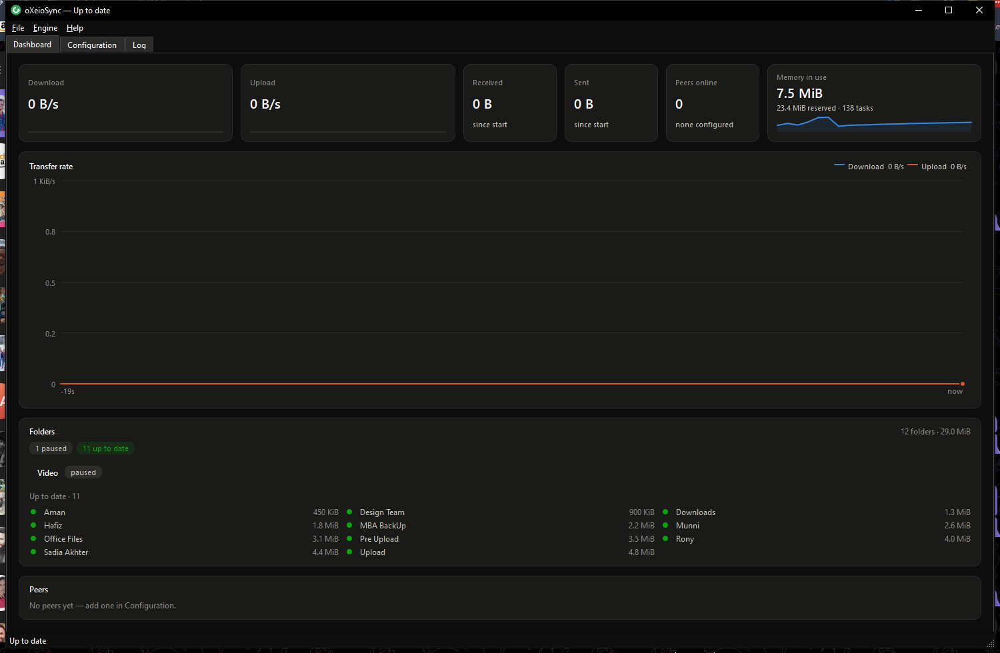
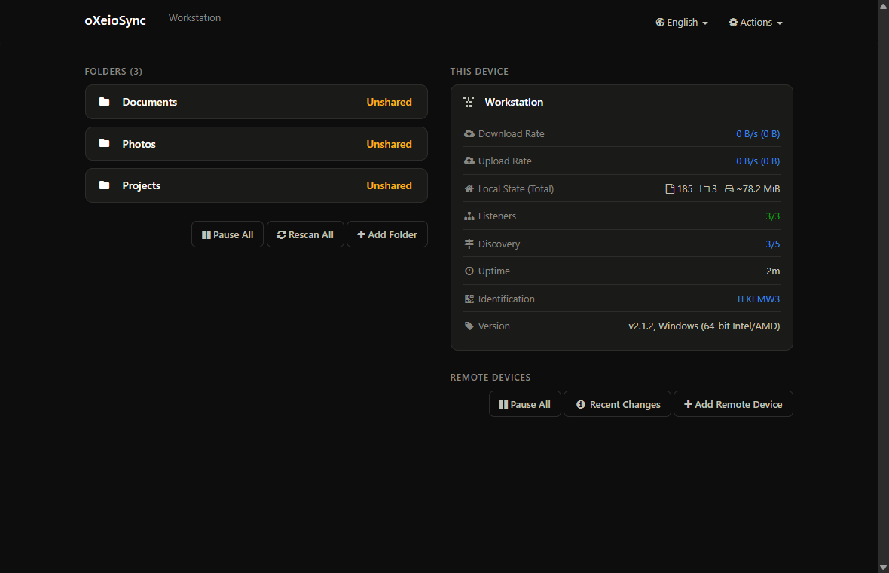
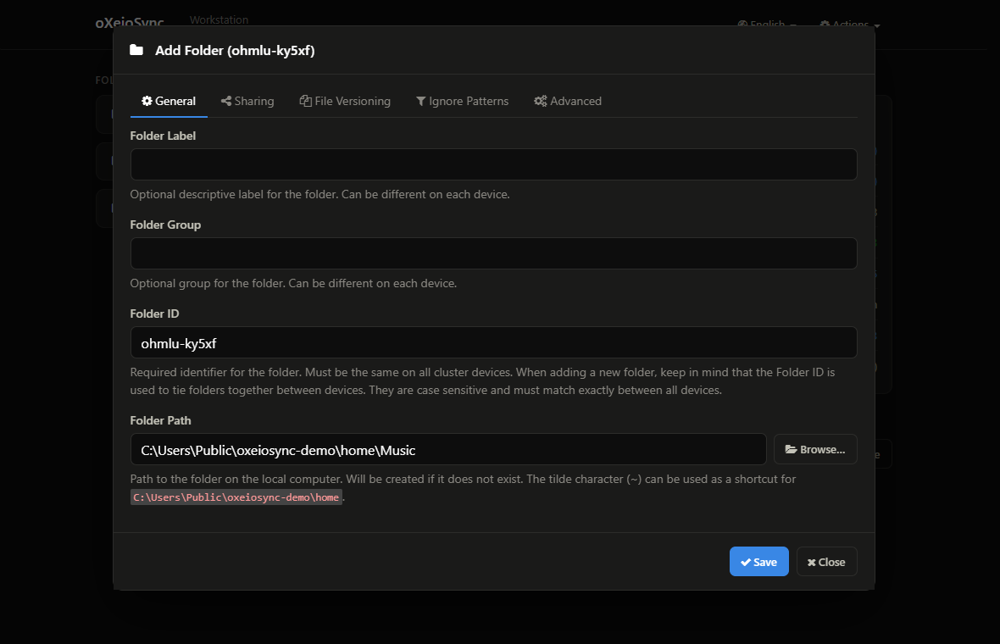

# oXeioSync

Keeps your folders in sync, from the system tray. Built with Python and PySide6,
in the spirit of [SyncTrayzor](https://github.com/canton7/SyncTrayzor), and
powered by [Syncthing](https://syncthing.net/) underneath.

Syncthing is a background service with a web interface. oXeioSync makes it a
desktop application: it supervises the engine so it starts, restarts and stops
cleanly, shows status from the tray, and puts a dashboard of its own in front —
live throughput, folder progress and peers, drawn in the application's own
visual language rather than borrowed. The engine's configuration screen is a tab
away, restyled to match.

*Developer documentation. It names Syncthing throughout because that is what the
code talks to; the application's own interface deliberately does not — see*
[On naming](#notes-on-a-few-decisions).

[](https://github.com/ownCoder/oXeioSync/releases/latest)


[](LICENSE)

## Download

[](https://github.com/ownCoder/oXeioSync/releases/latest/download/oXeioSync-setup.exe)

Windows 10 or later, 64-bit. That link always resolves to the newest release, so
it does not go stale between versions;
[every release](https://github.com/ownCoder/oXeioSync/releases) is listed with
its notes and the installer's SHA-256.

Installs per user, so there is no administrator prompt, and **nothing else is
needed** — the sync engine ships inside the installer, so a machine with no
Python, no Syncthing and no working route to GitHub is enough. Roughly ten
seconds, into `%LOCALAPPDATA%\Programs\oXeioSync`.

It is not code-signed, so SmartScreen warns the first time: *More info* →
*Run anyway*. Check what you downloaded first if you would rather:

```powershell
Get-FileHash oXeioSync-setup.exe -Algorithm SHA256
```

[](https://github.com/ownCoder/oXeioSync/releases/latest/download/oXeioSync.dmg)

macOS 11 (Big Sur) or later, **Apple Silicon** (arm64) — there is no universal or
Intel build yet. That link always resolves to the newest release. Open the
`.dmg` and drag oXeioSync to Applications; it carries its own engine the same way
the Windows installer does, so an offline machine is enough.

It is ad-hoc signed but not notarized, so Gatekeeper warns the first time:
right-click (or Control-click) the app → *Open* → *Open*. Or clear the quarantine
flag once:

```bash
xattr -dr com.apple.quarantine /Applications/oXeioSync.app
```

Check what you downloaded first if you would rather (the digest is in the release
notes):

```bash
shasum -a 256 oXeioSync.dmg
```

Prefer to build it yourself? See [Building for macOS](#building-for-macos).

## Screenshots



*The dashboard: download and upload on one shared axis, and folders ordered by
what wants attention — the paused one gets a row, the eleven that are fine get a
name and a size. The state itself is in the title bar and the status bar, so the
page does not repeat it. Twelve sample folders on an idle scratch profile, which
is why the chart is flat and no peers are configured.*



*The engine's configuration page, embedded and restyled to the same design —
same surfaces, ink, accent and type as the dashboard.*



*The folder dialog, with the Browse button that opens the system's folder
picker. The path field itself is untouched — typing and the page's own
completions still work.*

## What works

**Process supervision**
- Launches `syncthing` with no console window flashing on screen
- Forces the GUI address and API key at launch, so oXeioSync always knows how to
  reach the instance it started — no parsing of Syncthing's `config.xml`
- Restarts Syncthing with an increasing backoff if it exits unexpectedly, and
  recognises failures a restart cannot fix (a bound port, a locked database)
  instead of spinning in a loop
- Shuts down through the REST API so Syncthing flushes its database, escalating
  only if it stops responding — and then signalling the whole process tree,
  because Syncthing runs a supervisor plus a worker and killing just the one we
  launched would leave the worker holding the port and the database
- Aims the shutdown at the address the running instance was *launched* with, so
  changing the GUI address in Settings still ends in a clean stop
- Picks a free GUI port on first run if the default 8384 is already taken, which
  it very often is when another Syncthing or SyncTrayzor is installed

**Tray icon**
- Colour carries the status: green up to date, blue working, amber out of sync,
  red error, grey not running. Blue covers both syncing and scanning, and grey
  covers both stopped and connecting — the icon also *spins* whenever something
  is happening, so a spinning grey means "starting up", not "stopped"
- Context menu with folder and device lists, rescan, start/stop/restart, and
  settings; clicking a folder opens it in the file manager
- Balloon notifications for finished syncs, device connections, file conflicts
  and out-of-sync folders, each individually switchable

**Dashboard**
- A native dashboard is the default view, drawn in the application's own visual
  language — no third-party logo or wordmark anywhere in the interface
- Live throughput chart, sampled once a second: download and upload as two
  series on one shared axis, with a crosshair readout on hover
- Stat tiles for current rates (with sparklines on a shared scale), bytes moved,
  peers online, and the engine's own memory use
- The folders card is ordered by what wants attention, not by name. A folder
  with errors, one mid-transfer, one scanning or one paused gets a row of its
  own with the state in words and — where there is progress to show — a meter.
  Everything that is up to date collapses into a dense three-column list of
  name and size, under a count. Twenty healthy folders are four lines, and the
  one that cannot write its files is the first thing in the card
- A peer list with per-device rates
- Dark throughout, and not by inverting a light theme: the surfaces, ink and
  series colours are a set chosen for a dark ground. Qt's own widgets — menus,
  dialogs, the tab bar — are given the same tokens, so the frame and the
  dashboard inside it are the same dark

**Window**
- The engine's own configuration screen is embedded via QtWebEngine one tab
  away, with the API key injected on every request so it is authorised even when
  a password is set
- That page is restyled to the same design as the dashboard — same surfaces,
  ink, accent, radii and type — so it reads as part of this application rather
  than as a second program in a frame. Every control
  that remains behaves exactly as it did; the one thing removed is the Help
  menu, which was upstream links and an upstream About dialog from top to bottom
- The folder dialog's path field gets a Browse button that opens the system's
  folder picker — a web page cannot do that, but the application hosting it can.
  The field itself is untouched, so typing a path and the page's own completions
  still work; on an existing folder, whose path cannot be changed, the button is
  disabled to match
- Links that leave the configuration page open in the real browser
- A log tab showing the engine's live console output
- Closing and minimising hide to the tray by default, and syncing continues in
  the background. Both are switchable in Settings; with close-to-tray off, the
  close button quits instead

**Other**
- Ships Syncthing inside the installer, so a fresh machine needs nothing else —
  no download, no second installer, no working route to GitHub. The engine is
  pinned and checked against the SHA-256 digests published with its release at
  build time, and is shipped unmodified
- Falls back to downloading one, verified the same way, for a build made
  without a bundled engine or an installation whose engine has been removed
- Start on login (per-user, no elevation) — a registry Run key on Windows, a
  LaunchAgent on macOS
- Portable mode: keep everything in one relocatable folder
- Single instance per data folder — launching a second copy raises the first
  one's window instead of starting a rival against the same database. Two
  portable installs in different folders are independent and may run at once.

**Packaging**
- A one-folder Windows build with no Python needed on the target machine
- A per-user installer that needs no administrator rights, handles upgrades over
  a running copy, and never deletes your sync database unless you ask it to
- A macOS `.app` bundle (the engine inside `Contents/Frameworks`) and a
  drag-to-Applications `.dmg`, ad-hoc signed — see
  [Building for macOS](#building-for-macos)

## Not implemented yet

Compared to SyncTrayzor, still missing:

- A conflict *resolver*. Conflicts are detected and reported, but you have to
  resolve the files yourself.
- A file-transfer progress window (the Dropbox-style download list).
- Network metering — pausing devices on metered connections.
- Self-update. The installer handles upgrades, but the app will not fetch one
  for itself.
- Code signing and notarization. On Windows SmartScreen warns the first time the
  installer runs; on macOS the bundle is only ad-hoc signed — enough to launch,
  but not notarized (there is no Developer ID), so Gatekeeper warns on first
  open.
- Translations. The interface is English only.
- HTTPS with a self-signed certificate on the engine's own web interface. Not
  just the embedded browser: the REST client verifies certificates, so the
  status snapshots, the throughput sampler, the event feed and the clean
  shutdown would all fail too. Plain HTTP on loopback — the default — is fine.
- Linux. The code is written to run there and avoids Windows-only APIs outside
  a few clearly marked places, but nothing has been tested on it, and
  start-on-login is not implemented for it. macOS *is* supported — see
  [Building for macOS](#building-for-macos) — leaving Linux as the one desktop
  platform still untried.

## Requirements

**To use it:** nothing, and no network. The Windows installer and the macOS
`.app` each carry everything — the Python runtime and the sync engine both — so a
machine that has just been set up and has never seen either is enough. Windows 10
or later, 64-bit; macOS 11 (Big Sur) or later, built for the architecture it was
packaged on — arm64 on Apple Silicon, x86_64 on Intel, with no universal binary.

**To run from source or build it:** Python 3.11 or newer. A build fetches the
engine once into `build/vendor/` and bundles it from there; running from source
without doing that falls back to offering the download on first run.

## Running it

### The short way

[Download the installer](https://github.com/ownCoder/oXeioSync/releases/latest/download/oXeioSync-setup.exe)
and run it — per-user, no administrator prompt, about ten seconds. It lands in
`%LOCALAPPDATA%\Programs\oXeioSync` with a Start Menu entry, and starts syncing
without fetching anything. See [Download](#download) above for the SmartScreen
note and how to check the file's digest.

To build one yourself instead, see
[Building the installer](#building-the-installer) below.

**On macOS:** download `oXeioSync.dmg` (see [Download](#download) above) — or
build it from source ([Building for macOS](#building-for-macos)) — open it, and
drag the app to Applications. Because the build is ad-hoc signed but not
notarized, Gatekeeper blocks the very first launch — right-click (or
Control-click) oXeioSync in Applications and choose *Open*, then *Open* again in
the dialog; it launches normally from Launchpad or the Dock after that. To skip
the right-click, clear the quarantine flag once:

```bash
xattr -dr com.apple.quarantine /Applications/oXeioSync.app
```

### From source

Clone the repository:

```bash
git clone https://github.com/ownCoder/oXeioSync.git
```

From the project directory, create a virtual environment:

```bash
python -m venv .venv
```

Install the dependencies into it (PySide6 is a ~150 MB download, so this takes a
few minutes the first time):

```bash
.venv\Scripts\python.exe -m pip install -r requirements.txt
```

Then:

```bash
.venv\Scripts\python.exe -m oxeiosync
```

On Linux or macOS use `.venv/bin/python` instead of `.venv\Scripts\python.exe`
throughout.

### What happens on first run

1. **It starts the sync engine it came with.** The installer ships one, so there
   is nothing to fetch and no dialog: the first launch goes straight to a
   running engine, offline machines included.

   A build made without one (`--no-engine`), or an installation whose engine has
   been deleted, falls back to asking whether to download a copy. That copy is
   verified against the SHA-256 digests published with the release before
   anything is installed or executed, and lands in the data folder listed below.
   The release list comes from GitHub, falling back to the engine project's own
   metadata server when GitHub is unreachable or has rate-limited the address
   you are calling from — which, on a shared or NATed connection, it will.
2. **It picks a free port.** The usual port is 8384; if something already has it
   (another Syncthing, or SyncTrayzor) oXeioSync moves to the next free one and
   remembers the choice, rather than failing to start.
3. **The window opens on the Dashboard** — status, throughput chart, folders and
   peers. Nothing will be moving yet, because no folders are shared.
4. **A tray icon appears.** Its colour is the status: green idle, blue syncing,
   amber out of sync, red error, grey stopped. It spins while data moves.

### Sharing your first folder

Folders and devices are set up on the **Configuration** tab, which is the
engine's own screen embedded in the window:

1. **Configuration → Add Folder**, choose a directory, give it a label.
2. On the other machine, install oXeioSync (or Syncthing) and copy its device ID
   from *Actions → Show ID*.
3. Back here: **Add Remote Device**, paste that ID, and tick the folder to share.
4. Accept the pairing on the other machine.

Once they connect, the Dashboard's chart starts drawing.

### Command-line flags

| Flag | Effect |
| --- | --- |
| `--minimized`, `--minimised` | Start in the tray without showing the window |
| `--quit` | Ask a running instance to shut down, and wait until it has |
| `--verbose` | Log debug output to the console and the log file |
| `--version` | Print the version and exit |

`--quit` exists because there is otherwise no polite way for another program to
end this one: the close button only hides it to the tray, and terminating it
would take the sync engine down before it had flushed. It sends the request over
the same socket the single-instance guard uses, and returns only once the
instance has really gone — so a script can replace the files immediately
afterwards. The installer uses it for exactly that.

### Starting it automatically

**Settings → Start oXeioSync when I log in**. On Windows this writes a per-user
registry entry; on macOS it writes a per-user LaunchAgent under
`~/Library/LaunchAgents`. Either way there is no elevation and no scheduled
task, and it takes effect at the next login. Pair it with *Start minimised to
the tray* so login does not put a window on screen.

Running from a source checkout works, but `pip install -e .` first gives a
tidier login entry — see the note at the end of this file.

### Stopping it

Closing the window only hides it; the tray icon stays and syncing continues. To
actually quit, use **Exit** from the tray menu or **File → Exit**. Either way the
sync engine is stopped cleanly. From a script, use `--quit`.

## Troubleshooting

**"Another program is already listening on 127.0.0.1:8385…"**
Something else holds the port — very often an oXeioSync left running from
before. Check the tray first, then ask it to leave. That is the clean way: it
stops the engine through its API so the database is flushed.

```powershell
& "$env:LOCALAPPDATA\Programs\oXeioSync\oXeioSync.exe" --quit
```

```bash
/Applications/oXeioSync.app/Contents/MacOS/oXeioSync --quit
```

To find a copy that will not answer, and what is holding the port:

```powershell
Get-CimInstance Win32_Process | Where-Object CommandLine -like '*oxeiosync*' | Format-Table ProcessId, Name, CommandLine -AutoSize
```

```bash
pgrep -fl oxeiosync
lsof -nP -iTCP -sTCP:LISTEN | grep -i oxeiosync
```

Then stop it by id — `Stop-Process -Id <id> -Force` on Windows, `kill <pid>`
(and `kill -9 <pid>` only if it refuses to go) on macOS.

Two rows for one running copy is normal: an installed build spawns
`QtWebEngineProcess` (`.exe` on Windows), and a source run through a virtual
environment shows the venv's `pythonw.exe` (Windows) or `python` (macOS)
launcher alongside the base interpreter it starts.

Or leave it alone and change **Settings → Engine address** to a free port, then
restart the engine from the tray menu.

**"Another instance is already running"**
That is the single-instance guard doing its job — the running copy has been
asked to show its window; look for it in the tray. Two *portable* installs in
different folders are independent and may run at the same time.

**The window opens but the Dashboard says "Not running"**
The engine failed to start. Open the **Log** tab: a bind error means a port
clash, and a missing-binary message means **Settings → Download…** has not been
run yet.

**No tray icon**
Some Linux desktops need an appindicator extension for tray icons. oXeioSync
notices when no tray is available and shows the window instead, so it stays
usable.

**Can I switch to a light theme?**
No — oXeioSync is dark, and does not follow the host's light/dark preference in
either direction: neither the Windows app-mode setting nor the macOS Appearance
setting. The **Log** tab records it at start-up: `Dark theme applied`.

**Starting over**
Delete the data folder (below) and launch again — you get a fresh identity, a
fresh database and a fresh config. Your actual files are never in there.

## Where things live

The program and your data are kept apart, which is what lets an uninstall remove
one without touching the other.

| What | Where |
| --- | --- |
| The program | `%LOCALAPPDATA%\Programs\oXeioSync\` |
| Settings | `%LOCALAPPDATA%\oXeioSync\oxeiosync.json` |
| Sync database and device identity | `%LOCALAPPDATA%\oXeioSync\syncthing\` |
| Downloaded sync engine | `%LOCALAPPDATA%\oXeioSync\bin\` |
| Logs | `%LOCALAPPDATA%\oXeioSync\logs\` |
| Embedded browser profile | `%LOCALAPPDATA%\oXeioSync\webview\` |
| Instance lock | `%LOCALAPPDATA%\oXeioSync\oxeiosync.lock` |

Your synced files are wherever you told the engine to put them, and are never
inside any of the above.

On Linux and macOS the data root is `$XDG_CONFIG_HOME/oXeioSync` or
`~/.config/oXeioSync`, holding the same layout — `oxeiosync.json`, `syncthing/`,
`bin/`, `logs/`, `webview/` and `oxeiosync.lock`. On macOS the program itself is
the `/Applications/oXeioSync.app` bundle; uninstalling is dragging it to the
Trash, which — as on Windows — leaves the data root untouched, so your device
identity and sync database survive a reinstall.

**Portable mode.** Create a `data` directory next to the application before
first launch. Everything above moves inside it, and the whole installation can
be relocated by copying that one folder. Two portable copies in different
folders are independent and may run at the same time.

## What is in this repository

| Path | |
| --- | --- |
| `oxeiosync/` | The application |
| `oxeiosync/syncthing/` | Engine supervision: process, REST client, event feed, state model, 1 Hz sampler, binary download |
| `oxeiosync/ui/` | Tray, dashboard, painted charts, embedded configuration page, settings |
| `docs/screenshots/` | The images used above |
| `tests/` | Unit tests — no display or network needed |
| `tests/test_naming.py` | Guards the rule that the interface never names the upstream project |
| `tests/test_packaging.py` | Guards the promise that an installed copy carries its own engine |
| `tools/fetch_engine.py` | Vendors the sync engine into `build/vendor/` for the bundle |
| `tools/make_icon.py` | Renders the platform icon (`.ico` on Windows, `.icns` on macOS) from the app's own drawing code |
| `tools/build_exe.py` | Builds the executable, and the installer with `--installer` |
| `tools/smoke_exe.py` | Acceptance checks for the built executable |
| `tools/smoke_installer.py` | Acceptance checks for install, upgrade and uninstall |
| `packaging/oxeiosync.spec` | PyInstaller spec |
| `packaging/oxeiosync.iss` | Inno Setup script |
| `packaging/entry.py` | Frozen-build entry point — see the note on relative imports below |

## How it fits together

```
                        ┌──────────────┐
                        │     app      │  wiring: the only module that knows
                        │  Application │  the whole shape of the application
                        └──────┬───────┘
        ┌──────────────────────┼──────────────────────┐
        │                      │                      │
 ┌──────▼───────┐   ┌──────────▼────────┐   ┌─────────▼──────┐
 │ ui/tray      │   │ syncthing/state   │   │ syncthing/     │
 │ ui/main_     │◄──│ aggregated view   │   │   process      │
 │   window     │   │ + Qt signals      │   │ supervisor     │
 │ ui/dashboard │◄┐ └───┬───────────┬───┘   └───────┬────────┘
 └──────────────┘ │     │           │               │
                  │  ┌──▼───────┐ ┌─▼───────────┐ ┌─▼───────────┐
 ┌────────────────┴┐ │syncthing/│ │ syncthing/  │ │ syncthing/  │
 │ syncthing/      │ │  events  │ │   api       │ │   binary    │
 │   transfer      │ │long-poll │ │ REST client │ │ download +  │
 │ 1 Hz rate       │ │ worker   │ │             │ │ verify      │
 │ sampler         │ └──────────┘ └─────────────┘ └─────────────┘
 └─────────────────┘
```

Three sources feed the UI. **Snapshots** are periodic REST reads that rebuild the
full picture — authoritative but coarse, taken on a worker thread because each is
several blocking HTTP calls. **Events** come from the engine's long-polled feed
and say what just changed — the only place transient facts like "this folder
finished syncing" exist. Events drive notifications and trigger a debounced
snapshot; a slow heartbeat refresh runs regardless, so a missed event cannot
leave the UI stale.

The **transfer sampler** is separate and faster, on its own once-a-second
cadence. The engine reports only cumulative byte counters, so every rate on the
dashboard is derived from the difference between two readings — which makes the
sampling interval part of the measurement, and is why it does not ride the much
slower snapshot. A counter that goes backwards (the engine restarted) and a gap
in sampling (the machine slept) both reset the baseline rather than drawing a
spike that never happened.

Every component is deliberately ignorant of the others: the process supervisor
does not know a tray icon exists, and the state model does not know it is driving
notifications. `app.py` is the only place that connects them, which is what keeps
the interesting logic testable without a GUI.

All blocking work — HTTP, process output, downloads — happens on worker threads
and reaches the GUI as Qt signals. Nothing blocks the event loop.

## Building a Windows executable

```bash
.venv\Scripts\python.exe -m pip install pyinstaller
```

```bash
.venv\Scripts\python.exe tools\build_exe.py --clean --zip
```

That vendors the sync engine, regenerates the icon, runs PyInstaller against
`packaging/oxeiosync.spec`, and leaves a self-contained folder in
`dist\oXeioSync\` plus a zip beside it. The result needs no Python on the target
machine, and no network either. It is a **one-folder** build,
not a single file — QtWebEngine ships a helper executable and resource files it
locates relative to the Qt installation, and one-file would re-extract ~300 MB to
a temporary directory on every launch, including the launch that only wants to
hand off to an instance already running.

317 MB unpacked, in 90 files. Most of it is `Qt6WebEngineCore.dll` at 195 MB —
Chromium, and irreducible while the configuration page is a web page. The spec
trims about 240 MB of what PyInstaller would otherwise collect (557 MB before,
317 MB after): DevTools resources, debug-only `.pak` variants, Qt's own UI
translations, Chromium locale packs other than `en-US`, the QML tree that no code
here imports, and Qt's OpenSSL backend, which nothing here uses.

`opengl32sw.dll` is deliberately kept, at 20 MB: it is the software renderer the
embedded page falls back to on a virtual machine or a box with broken GPU
drivers, and that is the failure mode hardest to diagnose from a distance.

### The bundled engine

`tools/fetch_engine.py` puts an engine in `build\vendor\<os>-<arch>\`, and the
spec bundles it from there into `_internal\`. `build_exe.py` runs it for you; run
it directly to pin a version or to vendor one on a machine that cannot reach
GitHub:

```bash
.venv\Scripts\python.exe tools\fetch_engine.py --version v2.1.2
```

```bash
.venv\Scripts\python.exe tools\fetch_engine.py --from-archive syncthing-windows-amd64-v2.1.2.zip --sha256 4626c1...
```

The download goes through the application's own code, digest check included —
vendoring is not a second, laxer way to obtain a file that is about to be handed
to every machine this installer reaches. The offline forms refuse a file with no
digest to check it against unless you pass `--allow-unverified` and mean it.

It writes an `engine.json` manifest beside the binary, so a second build reuses
what is already there, and notices if the vendored file stops matching what the
manifest says it is.

Both the spec and the installer script **fail the build** when no engine is
present, rather than quietly producing something that needs the network on first
run. `--no-engine` opts out deliberately, and produces exactly that.

Two build knobs:

| | |
| --- | --- |
| `tools\build_exe.py --clean` | Remove `build/` and `dist/` first |
| `OXEIOSYNC_BUILD_CONSOLE=1` | Build a console variant. A windowed build has nowhere to print a start-up failure, so this is the only practical way to read one. |

Check the result with:

```bash
.venv\Scripts\python.exe tools\smoke_exe.py
```

It runs the built exe against a throwaway **empty** data folder and asserts the
things only a bundle can get wrong: that the bundle carries an engine at all,
that it starts, that it logs with no console attached, that the QtWebEngine
helper and the sync engine both spawn, that a second launch defers to the first,
and that shutting down leaves no orphans. Starting from empty is the point: a
pass means the build reached a running engine on what it shipped with.

## Building the installer

Needs [Inno Setup 6](https://jrsoftware.org/isinfo.php):

```bash
winget install --id JRSoftware.InnoSetup
```

```bash
.venv\Scripts\python.exe tools\build_exe.py --clean --installer
```

That produces `dist\oXeioSync-setup.exe` — 93 MB, solid LZMA2 squeezing the
317 MB payload down by roughly a factor of three. It takes about half a minute
on top of the executable build. Then check it:

```bash
.venv\Scripts\python.exe tools\smoke_installer.py
```

It installs silently, launches the installed app, upgrades over the *running*
copy, uninstalls, and asserts the outcome of each — including that the sync
database is still there afterwards.

### What the installer does

- **Per-user, no administrator prompt.** The app writes only to `%LOCALAPPDATA%`
  and keeps its start-on-login entry under `HKCU`, so it has nothing to ask for.
  It installs to `%LOCALAPPDATA%\Programs\oXeioSync` by default, and the user can
  choose a different folder.
- **Asks a running copy to leave, rather than killing it.** Closing the window
  only hides it to the tray, so Windows' Restart Manager cannot shut it down
  (it is switched off for that reason); and terminating it would take the sync
  engine down before it had flushed. `oXeioSync.exe --quit` asks the running
  instance to exit and returns once it has, which is also useful on its own for
  scripts. If anything does have to be forced, it is matched **by executable
  path** and stopped by process id — killing by image name would reach an
  unrelated copy, such as a portable one on a USB stick, and take its engine
  down too. If the executable is still locked afterwards the install stops
  rather than leaving a half-replaced folder behind.
- **Clears `_internal\` before upgrading**, so a stale DLL from an older build
  cannot be loaded in preference to the new one.
- **Never deletes your data by default.** `%LOCALAPPDATA%\oXeioSync` holds this
  machine's device identity and its record of what has been synced — losing it
  means re-pairing every device. An interactive uninstall offers to remove it,
  defaulting to *No*; a silent uninstall always keeps it. The offer is withheld
  entirely when it would be misleading: when the database has been moved
  elsewhere with `syncthing_home`, and when the folder only appeared because the
  uninstaller's own shutdown call created it.
- **Per-user only, with no "install for everyone" option.** The application
  resolves both its data folder and its autostart entry from the running user,
  so a machine-wide install would still give every user a separate identity,
  while the post-install launch built one in the administrator's profile.
- **Removes the start-on-login entry** on uninstall, so Windows is not left
  pointing at an executable that no longer exists.

The installer is unsigned, so SmartScreen will warn on first run until it has
built up reputation. Signing it needs a code-signing certificate.

### Publishing a release

Build from a clean tree and put the result through its acceptance checks first:

```bash
.venv\Scripts\python.exe tools/build_exe.py --clean --installer
```

```bash
.venv\Scripts\python.exe tools/smoke_exe.py
```

Then take the digest and cut the release:

```powershell
(Get-FileHash dist\oXeioSync-setup.exe -Algorithm SHA256).Hash
```

```bash
gh release create v0.1.0 dist/oXeioSync-setup.exe --title "oXeioSync 0.1.0" --notes-file notes.md
```

The notes carry that digest, because an unsigned installer gives whoever
downloads it nothing else to check it against.

The version appears in three places that have to agree, none of which derive
from the others: `APP_VERSION` in `oxeiosync/__init__.py`, `version` in
`pyproject.toml`, and the four `vers` fields in `packaging/version_info.txt` —
which is where the installer reads it from, since Inno Setup takes
`AppVersion` out of the built executable's own resources.

## Building for macOS

The same tooling produces a macOS build — the application code is cross-platform
and only the packaging differs. From a checkout with the dependencies installed
(Python 3.11+, PySide6, and `pip install pyinstaller`):

```bash
python tools/build_exe.py --clean --installer
```

That vendors the macOS sync engine, runs PyInstaller against the shared
`packaging/oxeiosync.spec` — which wraps the one-folder build into a real
`dist/oXeioSync.app` with an `Info.plist` — ad-hoc signs the bundle, and packs a
drag-to-Applications disk image at `dist/oXeioSync.dmg`. Check the result the
same way Windows does, against an empty data folder:

```bash
python tools/smoke_exe.py --exe dist/oXeioSync.app/Contents/MacOS/oXeioSync
```

A few things are particular to the Mac build:

- **Architecture follows the build machine.** On Apple Silicon it is an arm64
  `.app` — engine, Qt and Python all arm64; on an Intel Mac the same command
  produces an x86_64 build. There is no universal binary.
- **Ad-hoc signed, not notarized.** There is no Developer ID, so the signature
  is only enough to let Apple Silicon launch the app at all (an unsigned bundle
  is killed on sight). On first open Gatekeeper still warns — right-click the
  app → *Open*, or clear the quarantine flag:

  ```bash
  xattr -dr com.apple.quarantine /Applications/oXeioSync.app
  ```

- **Signing happens outside the source tree.** If the checkout lives in an
  iCloud- or OneDrive-synced folder, the file provider keeps re-stamping
  `com.apple.FinderInfo` onto the bundle, which `codesign` refuses; the build
  therefore signs and images a copy in a temporary directory, then copies the
  signed `.app` and the finished `.dmg` back into `dist/`. The `.dmg` is the
  authoritative artifact — a loose `.app` left in a synced `dist/` may have its
  signature re-stamped and invalidated by the next sync.
- **The icon** is rendered by `tools/make_icon.py` into `packaging/oxeiosync.icns`
  (via `iconutil`), which needs a working Qt platform plugin. On a build host
  without one the step is skipped with a warning and the bundle takes the
  default icon; run it once on a normal desktop session to produce the `.icns`.
- **Start on login** is a per-user LaunchAgent, not a registry entry — see
  [Starting it automatically](#starting-it-automatically).

## Development

```bash
.venv\Scripts\python.exe -m pytest -q
```

```bash
.venv\Scripts\python.exe -m ruff check oxeiosync tests tools
```

The rule set is declared in `pyproject.toml` rather than left to ruff's
defaults, so that command is the check this project actually means — and it
passes. Qt's camelCase overrides are exempted by name, with a comment saying
why.

264 unit tests (3 skipped), and they need neither a display nor a network — everything they
touch is either pure logic or stubbed. They cover config parsing and its
tolerance of bad input, bind-address handling and port probing, overall-status
derivation, event folding, the restart-backoff and fatal-failure rules, rate
derivation from cumulative counters, axis scaling and byte formatting, release
selection and checksum verification, the instance lock, the login command the
autostart entry writes, the folder picker's starting directory, and the naming
rule below.

`tests/test_naming.py` is worth singling out. The rule that the interface never
names the upstream project is easy to state and easy to break: three separate
leaks got past review — a heading on the offline placeholder, an authentication
error that surfaces in a tray notification, and two download failures shown in a
dialog. Each was invisible until someone hit that exact state. The test walks
every string literal in the package and fails on any that names the project
without appearing in an approved list, each entry carrying its reason (a log
message, a filename, a config key, the About attribution). Adding one is now a
deliberate act. The test also checks that it can still fail, and that no
approved entry has gone stale.

Three further suites are not part of `pytest`, because each needs a real build
or a real engine to be worth anything:

| | |
| --- | --- |
| `tools\smoke_exe.py` | 12 checks against the built executable |
| `tools\smoke_installer.py` | 20 checks across install, upgrade and uninstall |
| `tools\smoke_exe.py --cold` | The first-run engine download. **Interactive** — the app asks for consent, so a dialog appears and the run waits for an answer. |

The split is deliberate: `pytest` stays fast and unattended, and the things that
can only fail in a bundle get tested against a bundle.

## Notes on a few decisions

**Why `subprocess` rather than `QProcess`?** Hiding the console window on Windows
needs `CREATE_NO_WINDOW`, which Qt only exposes through an API PySide does not
wrap. Without it, every launch flashes a console window.

**Why force the API key instead of reading Syncthing's config?** Passing
`STGUIADDRESS` and `STGUIAPIKEY` at launch means there is never a window where we
have to discover, parse or guess how to talk to the process we just started.
Syncthing 2.x rejects unauthenticated REST calls, so knowing the key matters.

**Why are the icons and charts drawn in code?** No binary assets and no charting
dependency, crisp rendering at whatever size is asked for, exact control over the
mark specs, and rotating the icon glyph gives the syncing animation for free.

**Why dark only, and why the Fusion style.** The dashboard's colours are chosen
for a dark ground and validated on one. Following the host's app-mode setting
would mean using them on a light surface whenever that setting says so, and it
would put the appearance of the program in the hands of a preference someone may
have set for something else entirely. So the palette is supplied rather than
asked for: `apply_dark_theme` installs it before the first widget exists.

Supplying it is only half of it. Every colour here is read back *from* the Qt
palette — that is how the painted dashboard, the charts and the restyled
configuration page agree with each other and with the window around them — and
Windows' native style paints parts of itself from the system theme rather than
from the palette it was handed. Applied under it, the content goes dark and the
tab bar, menu and scrollbars stay light. Fusion draws everything from the
palette, so it is the style the dark palette is applied through.

This is also what the earlier arrangement got wrong. Qt reports the host's
scheme perfectly well — `colorScheme()` says `Dark` the moment Windows does —
but the native style hands back a `#f0f0f0` window regardless, and since every
token here comes from the palette, the dark set was unreachable. The setting was
read by something and honoured by nothing.

**Why no processor-load chart?** The engine still reports a `cpuPercent` field,
but current builds leave it at zero — measured here at 0 throughout a 400 MB
hashing run. A chart pinned at zero looks broken rather than informative, so the
second chart plots heap in use, which does move.

**On naming.** The interface never shows the upstream project's logo or name;
the engine is referred to as "the sync engine" throughout. On the configuration
page the wordmark is replaced, and the Help menu is hidden in full — every one of
its entries was upstream documentation or the upstream About dialog. The
Actions menu stays, because Show ID lives there and pairing needs it. The one
place the project is named is a single attribution line in Help → About in *our*
window, which is where a reader expects to find out what a program is built on.
The engine's own log output, shown in the Log tab, is left exactly as it comes —
it is diagnostic text, and rewriting it would make it harder to search for. The
discovery-server addresses shown in its status tooltips are left alone too: they
are functional URLs, and rewriting a URL would make it wrong. The rule is
enforced by a test rather than by care, because care demonstrably was not
enough — see `tests/test_naming.py`.

**Why restyle the page instead of rebuilding it natively?** A native folder and
device editor would have to reimplement path pickers, ignore patterns, file
versioning, and every advanced option — and would drift out of step with the
engine on each release. Restyling keeps one source of truth for the settings and
still gets a consistent interface. The trade-off is that the stylesheet targets
the page's current markup, so an upstream redesign would need it revisited.

**Why does the Browse button talk through `window.prompt`?** The injected script
needs one thing the page cannot do for itself: open a native folder dialog and
wait for the answer. `prompt` is the only call a page makes that reaches the host
and blocks for a reply, so the button asks for `oxeiosync:pick-folder` and
`QWebEnginePage.javaScriptPrompt` answers it with a chosen path — no channel to
set up, and the result arrives where the button already is. Only that one message
is answered, and only from the configuration page's own origin. The path is
written back with an `input` event after it, because the page watches for one:
assigning the value alone would show the new path on screen and save the old one.

**Why a file lock for single-instance rather than just a socket?** On Windows a
local socket name is a named pipe, and several processes can each create their
own instance of the same name — so two launches can both believe they are the
first. There is also a plain race: two launches milliseconds apart both find
nobody listening. An advisory file lock is granted by the kernel to exactly one
process and released automatically when it dies, so there is no stale state to
recover from either. The socket is still used, but for messages rather than
exclusion: *show your window*, and *quit*.

**Why the frozen build has its own entry point.** PyInstaller runs its entry
script as a top-level module with no package context, so pointing it at
`oxeiosync/__main__.py` makes every `from . import …` in it fail — before
logging exists, and in a windowed build with nowhere to print it. The first
build did exactly that and produced an executable that started, did nothing, and
said nothing. `packaging/entry.py` imports the package by name instead, which
gives those imports the parent they need. `OXEIOSYNC_BUILD_CONSOLE=1` exists for
the same reason: a windowed bundle cannot tell you why it failed.

**Start on login from a source checkout.** Neither the Windows `Run` key nor the
macOS LaunchAgent controls the working directory, so a bare `-m oxeiosync` would
fail at login. The command written for a checkout puts the project directory on
`sys.path` explicitly. `pip install -e .` produces a tidier entry, and is preferred
automatically when present.

**Syncthing's own auto-upgrade is left enabled — for the downloaded copy.** The
managed binary lives in a user-writable directory that no installer touches, so
Syncthing can update itself the way it normally would; only the initial download
goes through oXeioSync. The *bundled* copy is launched with `STNOUPGRADE=1`,
because it sits in the program folder, which the installer replaces wholesale on
every update: an engine that upgraded itself there would be silently reverted by
the next install, and the digest published in the notice beside it would stop
describing the file it names.

## Licence

MIT — see [LICENSE](LICENSE).

Syncthing itself is MPL-2.0. It is bundled with the installer, unmodified and
byte-identical to the official release, and it stays under its own licence:
MPL-2.0 is per-file copyleft, so nothing about it changes oXeioSync's terms.
Every build ships the engine's own `LICENSE-engine.txt` and `AUTHORS-engine.txt`
verbatim from its release archive, plus a generated `ENGINE-NOTICE.txt` naming
the exact version, its SHA-256, and where to obtain the corresponding source —
which is what redistributing an MPL-2.0 binary actually requires. They install
to the top of the program folder.

This is a description of how the project meets those terms, not legal advice.
